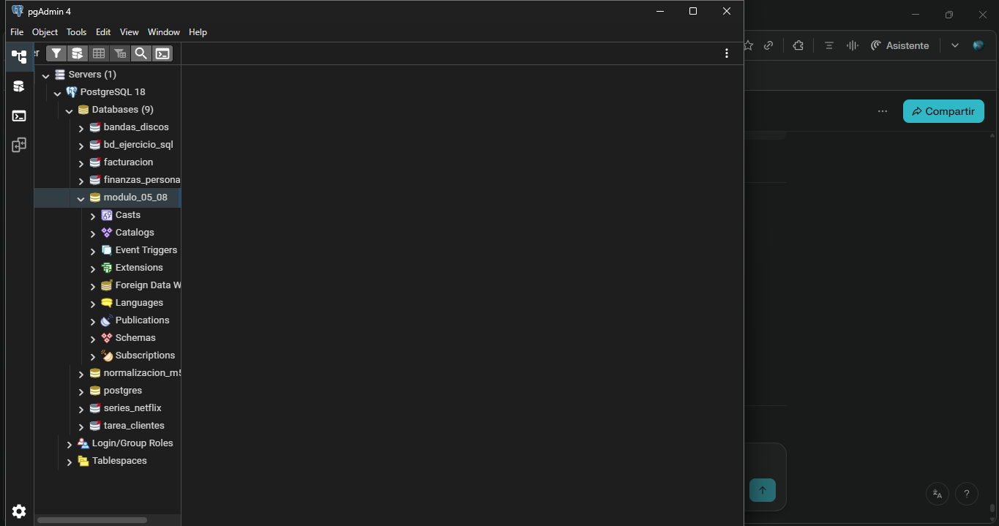
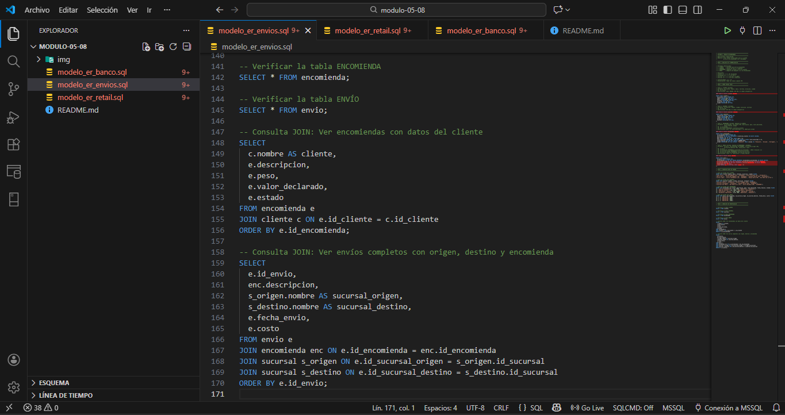
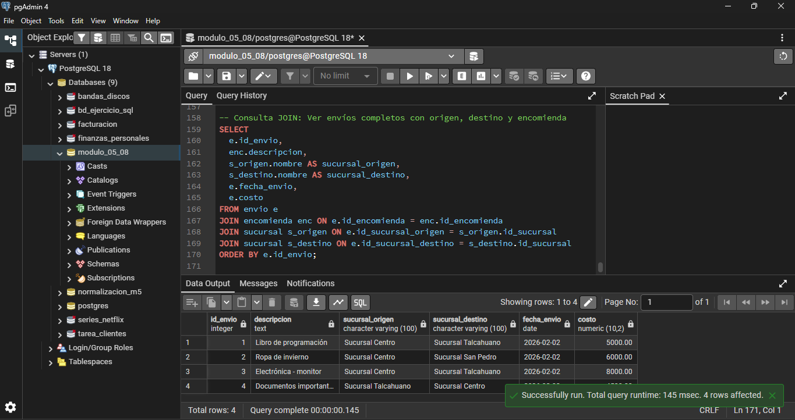
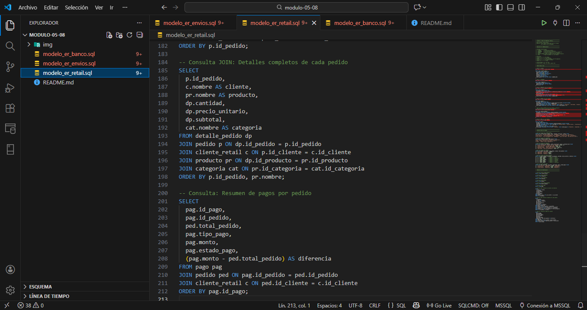
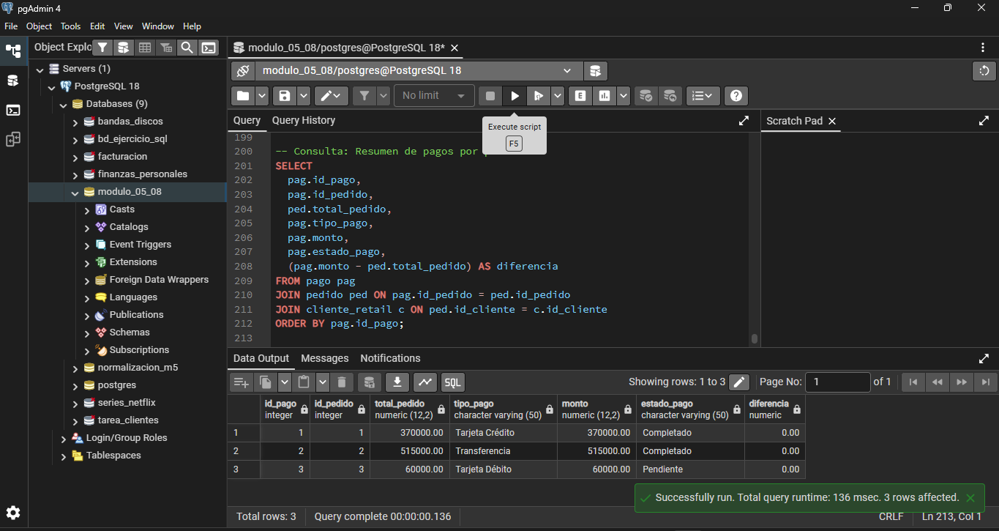
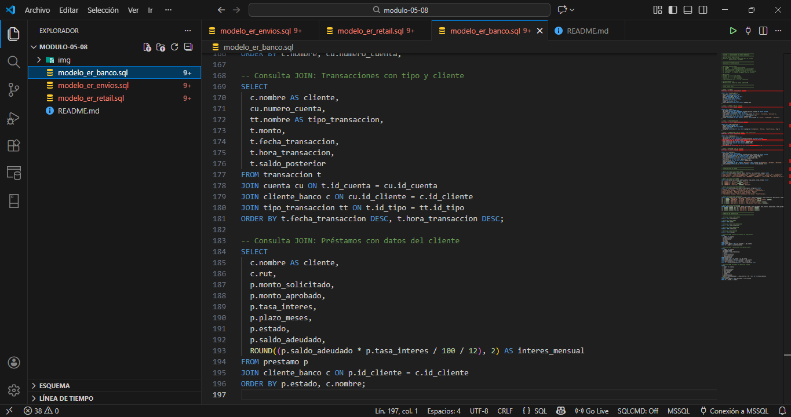

# Módulo 05 - Lección 5: Ejercicio Práctico Actividad Modelado ER y Normalización 

## Modelado ER y Normalización

Se crearon tres sistemas diferentes de bases de datos. Apliqué el modelo Entidad-Relación y normalicé las tablas hasta 3FN.

## Creación de carpetas principales

En la imagen se ve la creación de carpeta y archivos principales a utilizar en VSC.

En la imagen se ve la creación de la carpeta principal que utilizaremos en pgAdmin 4.

## Sistema 1: Envío de Encomiendas

Sistema para guardar información de encomiendas que se envían, con datos de clientes, sucursales y el registro del envío. Se creó:

- **CLIENTE**: Los que envían paquetes (nombre, email, teléfono, dirección)
- **SUCURSAL**: Los lugares de donde salen y llegan las encomiendas
- **ENCOMIENDA**: El paquete que se va a enviar (descripción, peso, valor)
- **ENVÍO**: El registro de cuándo se despacha el paquete

### Diagramas scripts

En la imagen se ve cómo estoy creando las tablas en VS Code.

### Las tablas en pgAdmin y datos insertados

Aquí se ven las 4 tablas ya creadas en la base de datos. Además de la consulta final mostrando todo lo creado correcto.

## Sistema 2: Venta de Productos (Retail)

Sistema para una tienda online. Tiene clientes, productos organizados en categorías, pedidos, y el registro de pagos. Se creó:

- **CLIENTE_RETAIL**: Los que compran en la tienda
- **CATEGORÍA**: Los tipos de productos (Electrónica, Ropa, Libros)
- **PRODUCTO**: Los artículos que se venden (con precio y stock)
- **PEDIDO**: Las órdenes que hacen los clientes
- **DETALLE_PEDIDO**: Los productos dentro de cada pedido (tabla intermedia)
- **PAGO**: El registro del pago de cada pedido

### Diagramas scripts

En la imagen se ve que creé 6 tablas. Esta fue más compleja que la anterior.

### Las tablas en pgAdmin

Las 6 tablas se crearon sin problemas. Además de mostrar las consultas de pago por pedidos correctamente.

## Sistema 3: Cuentas Bancarias

Sistema para un banco. Tiene clientes con cuentas, transacciones o movimientos y préstamos. Se creó:

- **CLIENTE_BANCO**: Las personas que tienen cuentas
- **CUENTA**: Las cuentas bancarias (ahorro, corriente, inversión)
- **TIPO_TRANSACCIÓN**: Las categorías de movimientos (depósito, retiro, etc.)
- **TRANSACCIÓN**: Los movimientos que hace la persona (depósitos, retiros)
- **PRÉSTAMO**: Los créditos que el banco otorga

### Diagramas scripts

Aquí creé 5 tablas para el sistema bancario.

### Las tablas y consultas en pgAdmin

Las 5 tablas se crearon correctamente. Además de mostrar los resultados de consultas de interés mensual de préstamos.

## ¿Qué es la Normalización?

Normalizar es organizar bien la base de datos para que no haya datos repetidos y sea fácil de actualizar.

### 1FN - Primera Forma Normal
Cada celda tiene solo UN valor. No hay listas ni valores juntos.

Ejemplo malo: `Cursos: MAT101|PHY101`  
Ejemplo bueno: En una fila MAT101, en otra PHY101

### 2FN - Segunda Forma Normal
Además de 1FN, si una tabla tiene una clave compuesta, cada dato debe depender de TODA la clave, no de solo una parte.

En el Sistema 2, la tabla `DETALLE_PEDIDO` tiene clave compuesta (id_pedido, id_producto). Los datos de ahí dependen de AMBAS claves.

### 3FN - Tercera Forma Normal
Además de 2FN, no hay datos que dependan de otros datos que no sean clave.

Ejemplo: En el Sistema 3, la oficina del banco depende del cliente, no de la transacción. Por eso están en tablas separadas.

## SQL usados

- **PRIMARY KEY (PK)**: Identifica cada fila única
- **FOREIGN KEY (FK)**: Conecta una tabla con otra
- **UNIQUE**: No permite valores repetidos
- **NOT NULL**: Dice que el campo es obligatorio
- **CHECK**: Valida que los valores sean correctos (como que el precio sea mayor a 0)
- **ON DELETE CASCADE**: Si borro un cliente, se borran sus pedidos automáticamente

## Archivos

- `modelo_er_envios.sql` - El código para crear el Sistema 1
- `modelo_er_retail.sql` - El código para crear el Sistema 2
- `modelo_er_banco.sql` - El código para crear el Sistema 3
- `img/` - Las imágenes de cada paso
- `README.md` - Este archivo

## Autor

Patricio Valenzuela Henríquez

## Repositorio

https://github.com/PATRICIORVH/modulo-05-08
